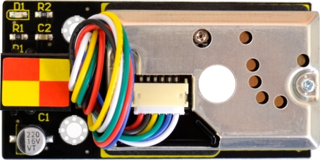
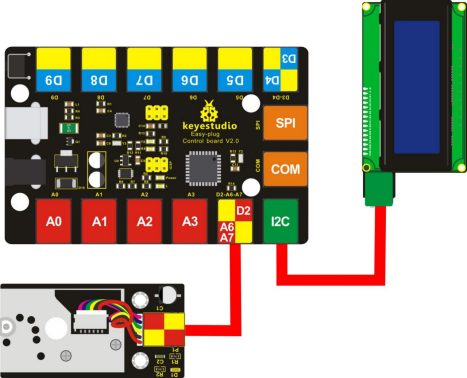
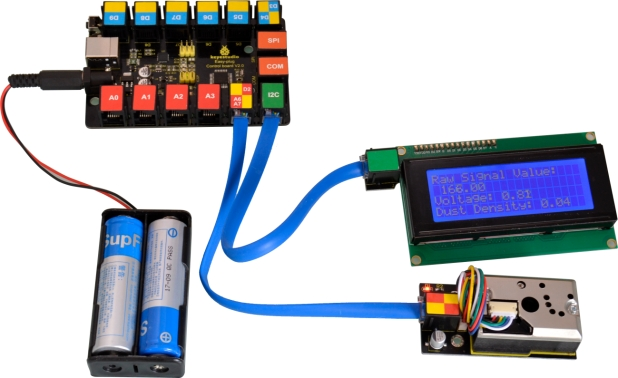
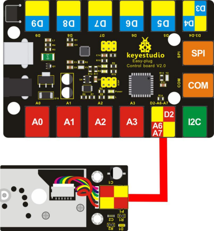
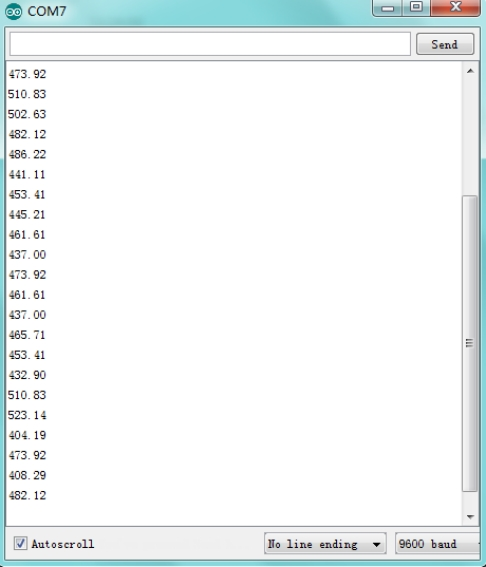

# KS0394 EASY plug GP2Y1014AU PM2 Dust Sensor Module

Download  Resources :  [Resources](./Resources.7z)



## 1. Description

EASY plug GP2Y1014AU PM2.5 Dust sensor is particularly effective in detecting very fine particles, such as cigarette smoke, and is commonly used in air purifier system.

In the device, an infrared light emitting diode and a phototransistor are diagonally arranged to allow it to detect the light reflected by dust in the air.

The sensor has very low current consumption (up to 20mA, typical of 11 mA) and can carry up to 7VDC sensors.

The output is an analog voltage proportional to the measured dust concentration, with a sensitivity of 0.5V/0.1mg/m3.

The sensor's four pins are led out as Registered Jack, allowing you to connect it to EASY plug Control board V2.0 for communication with only an RJ11 cable. 

**Special Note:**

The sensor/module is equipped with the RJ11 6P6C interface, compatible with our keyestudio EASY plug Control Board with RJ11 6P6C interface.

If you have the control board of other brands, it is also equipped with the RJ11 6P6C interface but has different internal line sequence, can’t be used compatibly with our sensor/module.

## 2. Technical Details

- Power supply voltage: 5-7V
- Working temperature: -10 to +65 degrees Celsius
- Current consumption: 20mA maximum
- Minimum particle detection: 0.8 microns
- Sensitivity: 0.5V/(0.1mg/m3)
- Voltage in clean air: 0.9V (typical)
- Working temperature: -10°C to 65°C
- Storage temperature: -20°C to 80°C
- Service life: 5 years
- Dimensions: 35.6mm × 69.7mm × 28mm
- Weight: 27g

## 3. Example 1 Test Dust Density

**Connect It Up:**



**Upload the Code 1:**

Note： before uploading the code, you need to import the library files; otherwise, the code upload will fail.

```c
#include <Wire.h> 
#include <LiquidCrystal_I2C.h>
LiquidCrystal_I2C lcd(0x27,20,4);  // set the LCD address to 0x27 for a 16 chars and 2 line display
int measurePin = 6; //Connect dust sensor to Arduino A6 pin
int ledPower = 2;   //Connect 3 led driver pins of dust sensor to Arduino D2
int samplingTime = 280;
int deltaTime = 40;
int sleepTime = 9680;
float voMeasured = 0;
float calcVoltage = 0;
float dustDensity = 0;

void setup()
{
  lcd.init();                      // initialize the lcd 
  lcd.init();
  // Print a message to the LCD.
  lcd.backlight();
  lcd.setCursor(0,0);
  lcd.print("Raw Signal Value: ");
  lcd.setCursor(0,2);
  lcd.print("Voltage:");
  lcd.setCursor(0,3);
  lcd.print("Dust Density:");
  pinMode(ledPower,OUTPUT);
}

void loop()
{
  digitalWrite(ledPower,LOW); // power on the LED
  delayMicroseconds(samplingTime);
  voMeasured = analogRead(measurePin); // read the dust value
  delayMicroseconds(deltaTime);
  digitalWrite(ledPower,HIGH); // turn the LED off
  delayMicroseconds(sleepTime);
  // 0 - 5V mapped to 0 - 1023 integer values
  // recover voltage
  calcVoltage = voMeasured * (5.0 / 1024.0);
  // linear eqaution taken from http://www.howmuchsnow.com/arduino/airquality/
  // Chris Nafis (c) 2012
  dustDensity = 0.17 * calcVoltage - 0.1;
  lcd.setCursor(1,1);
  lcd.print(voMeasured);
  lcd.setCursor(9,2);
  lcd.print(calcVoltage);
  lcd.setCursor(14,3);
  lcd.print(dustDensity);
  delay(1000);
}
```

**Example Result**

Done uploading the code, you should be able to see the measured dust density is showed on the LCD screen.



## 4. Example 2 Air Quality

**Connect It Up:**



**Upload the Code 2:**

```c
int dustPin=6;
float dustVal=0; 
int ledPower=2;
int delayTime=280;
int delayTime2=40;
float offTime=9680;

void setup()
{
    Serial.begin(9600);
    pinMode(ledPower,OUTPUT);
    pinMode(dustPin, INPUT);
}
 
void loop()
{
    // ledPower is any digital pin on the arduino connected to Pin 2 on the sensor
    digitalWrite(ledPower,LOW); 
    delayMicroseconds(delayTime);
    dustVal=analogRead(dustPin); 
    delayMicroseconds(delayTime2);
    digitalWrite(ledPower,HIGH); 
    delayMicroseconds(offTime);
    delay(1000);
    if (dustVal>36.455)
    	Serial.println((float(dustVal/1024)-0.0356)*120000*0.035);
}
```

**Example Result:**

Done upload the code, open the Arduino IDE’s serial monitor, and set the baud rate to 9600, you should be able to see the data.



Compare the measured data to the air quality:

- 3000+ = very poor
- 1050-3000 = poor
- 300-1050 = general
- 150-300 = good
- 75-150 = very good
- 0-75 = excellent